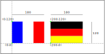

Activité
========

Les drapeaux suivants sont constitués de trois rectangles de couleurs différentes. Le drapeau français est constitué de 3 rectangles bleu, blanc et rouge et le drapeau de l'Allemagne est constitué de trois rectangles jaune, rouge et noir.

   
L'objectif est de dessiné ces drapeaux avec le module ``turtle`` en respectant l'ordre des couleurs et la disposition verticale ou horizontale des rectangles.

La figure ci-dessous donne les dimensions et les coordonnées à respecter pour représenter ces 2 drapeaux.

Le script Python est enregistré dans un fichier ``drapeau.py`` et contient les instructions suivantes:

.. literalinclude:: ../python/drapeau.py
   :language: python

Fonction déplacer
-----------------

Pour tracer les rectangles de couleur différente, il va falloir déplacer la tortue au bon endroit. Le déplacement de la tortue se fait avec les 3 fonctions ``up``, ``goto`` et ``down`` du module ``turtle``. L'objectif est donc de créer une fonction ``deplacer`` qui appelle ces 3 fonctions. On donne le début du code à compléter:

.. code-block:: python

   def deplacer():
       # on lève le crayon
       up()
       # on déplace la tortue
       ...
       # on baisse le crayon
       down()

#. Recopier cette fonction dans la partie de code du fichier ``drapeau.py`` réservée aux fonctions.
#. Compléter la fonction pour déplacer la tortue à l'endroit voulu.
#. En l'état, la fonction ``goto`` ne sait pas à quelles coordonnées elle doit déplacer la tortue. Pour cela, on utilise des paramètres ``x,y`` qui désignent les coordonnées où placer la tortue.

   a. Ajouter ces paramètres : ``deplacer(x,y)``
   b. Utiliser les même paramètres pour la fonction ``goto(x,y)``.

#. On va appeler cette fonction et vérifier qu'elle déplace bien la tortue.

   a. Exécuter le code ``drapeau.py`` et vérifier que la fenêtre graphique s'affiche avec la tortue.
   b. Dans l'interpréteur (console), saisir l'instruction ``deplacer(100,100)`` puis sur la touche "entrée".
   c. Vérifier que la tortue se déplace. Faire d'autres tests ou corriger votre fonction en cas d'erreur.

La fonction rectangle
----------------------

Pour créer un drapeau de trois couleurs, il faut tracer 3 rectangles de couleur différente qui s'alignent correctement et dans le bons sens. Cela suppose de connaître la largeur, la hauteur et la couleur de chaque rectangle qui compose le drapeau.

On va écrire la fonction ``rectangle`` qui construit un rectangle de couleur. La fonction a 3 paramètres qui sont:

- ``largeur`` pour la largeur du rectangle;
- ``hauteur`` pour la hauteur du rectangle;
- ``couleur`` pour la couleur de remplissage et le tracé du rectangle.

#. Ajouter la fonction ``rectangle`` avec ses 3 paramètres dans le fichier ``drapeau.py``

   .. code-block:: python

      def rectangle(largeur, hauteur, couleur):
          begin_fill()
          color(couleur)
          for i in range(2):
             forward(largeur)
             left(90)
             forward(hauteur)
             left(90)
          end_fill()

#. Exécuter le fichier ``drapeau.py`` puis saisir dans l'interpréteur l'instruction ``rectangle(100,150,"blue")`` et vérifier que le rectangle bleu se dessine bien dans la fenêtre graphique.

Le programme principal
----------------------
   
Nous allons écrire le code pour tracer les drapeaux de la France et de l'Allemagne en utilisant nos fonctions ``deplacer`` et ``rectangle``.

   
#. Repérez les coordonnées du coin bas et gauche de chaque rectangle qui compose le drapeau français.
#. Dans la console, saisir les fonctions ``deplacer`` et ``rectangle`` pour dessiner le drapeau français.
#. Lorsque vous avez réussi, ajoutez les instructions dans le code du fichier ``drapeau.py``, dans la partie programme principal, pour dessiner le drapeau de la France.
#. Faire de même avec le drapeau de l'Allemagne. Attention, il doit être positionné à côté du drapeau français et avoir les mêmes dimensions.
   
Aller plus loin
-----------------

On peut optimiser le code qui dessine les drapeaux.

-  En utilisant un tableau avec les couleurs du drapeau à dessiner;
-  En utilisant une boucle ``for`` qui contient les instructions ``deplacer`` et ``rectangle``;
-  En créant une fonction ``dessine_drapeau`` qui dessine le drapeau demandé.

#. Créer la variable ``fr`` contenant un tableau avec les 3 couleurs du drapeau français.
#. Remplacer votre code dessinant le drapeau français par la boucle ``for`` suivante à compléter:

   .. code-block:: python

      x,y = 0,0
      for couleur in fr:
          deplacer(x,y)
          rectangle(...,...,couleur)
          x = ...

#. Créer la fonction ``dessine_drapeau`` qui a pour paramètres :

   -  ``x`` et ``y`` qui sont les coordonnées du coin bas et gauche du drapeau,
   -  ``largeur`` et ``hauteur`` qui sont les dimensions du drapeau à dessiner,
   -  ``pays`` qui est un tableau avec les couleurs du drapeau à dessiner.

#. Ajouter un paramètre ``position`` qui adapte le dessin du drapeau selon que les rectangles sont verticaux ou horizontaux.
