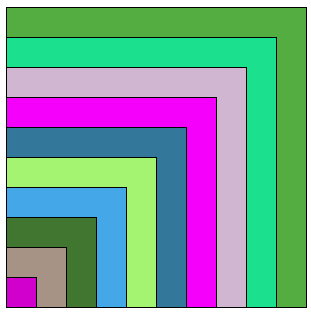

.. 1NSI

.. toctree::
   :maxdepth: 1
   
Exercices d'approfondissement
=============================

Exercice 1
----------

Écrire un code en Python pour réaliser avec le module turtle la figure suivante:

   
.. rubric:: Contraintes à respecter

- Définir une variable ``n`` pour le nombre de carrés
- Écrire une fonction ``carré`` ayant pour paramètre ``cote`` pour la mesure du coté du carré et ``couleur`` pour la couleur de remplissage du carré.
- Écrire une boucle ``for`` qui construit les différents carrés de couleurs.

.. tip::

   On définit les couleurs par un tuple de trois valeurs choisies au hasard. 
   Pour cela, il faut :
   
   - importer la fonction ``randint`` du module ``random``
   - définir la variable ``couleur`` par ``couleur=(randint(0,255),randint(0,255),randint(0,255))``

Exercice 2
----------

Écrire un code en Python pour réaliser avec le module turtle la figure suivante:

   

   
.. rubric:: Contraintes à respecter

- Il y a autant de disque blanc que de disque rouge
- Définir une variable ``n`` correspondant au nombre de disque rouge ou blanc
- Définir une varaible ``rayon`` pour les rayons des disques
- Écrire une fonction ``deplacer`` qui positionne la tortue au bon endroit pour tracer un cercle
- Écrire une fonction ``cercle`` qui trace un cercle de couleur pour un rayon et une couleur passés en arguments
- Le plus grand disque a un rayon de 200 et une couleur rouge
- L'écart entre chaque disque est le même et dépend du nombre de disques
- La figure doit rester correcte si on change la dimension du rayon du grand disque

Exercice 3
----------

Le tapis de Sierpinski est réalisé à partir d'un motif répété plusieurs fois en modifiant sa taille. On en donne une illustration dans le cas du carré.

Écrire un code en Python pour réaliser avec le module turtle le tapis de Sierpinski.

.. tip::

   - Le motif initial est un grand carré noir percé en son milieu d'un carré blanc dont la mesure du côté est le tiers de la mesure du côté du grand carré noir.
   - Ici le tapis est de taille ``n=3``.

Exercice 4
----------

Le tapis de Sierpinski suivant est réalisé à partir d'un motif triangulaire répété plusieurs fois en modifiant sa taille.

Écrire un code en Python pour réaliser avec le module turtle le tapis de Sierpinski.
